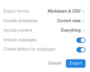

# notion-to-google-docs
Export hierarchical Notion content to Google Docs

Use when you want to export an entire section from Notion to Google Drive. Creates documents out of regular pages and spreadsheets out of databases.

## Installation

- Clone this repository.

## Usage

- Get OAuth2 credentials for interacting with Drive. See details [here](https://developers.google.com/drive/api/quickstart/python#set-up-environment). Save these credentials as "token.json" in the same directory as the script.
- Export the section out of Notion as "Markdown/CSV":

- Download and unzip the zip file containing the exported content.
- Get the folder ID of the Drive folder you want your content to end up in. The ID can be found in the URL when browsing to it in the Drive web UI - `https://drive.google.com/drive/folders/<folder_id>`
- Set the folder ID at the top of the script.
- Run the script with the path of the exported content as argument.

## Limitations

- Pictures will not be included. This is because the Notion Markdown/CSV export includes and refers to such content locally, whereas Drive can only retrieve images if they're available from the Internet.
- Links will not work.
- The script deals with all uploads sequentially and would perform better if they're parallellized instead. Possible future improvement.